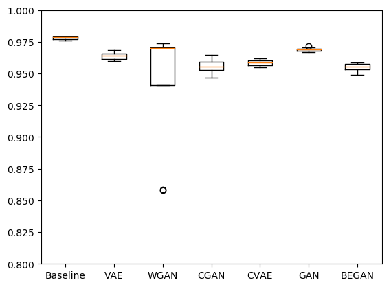
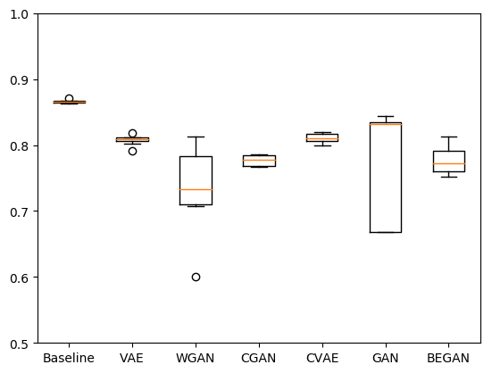

# Training Discriminative Models to Evaluate Generative Ones


<table width="500" cellpadding="5">
<tr>
  
  <td align="center" valign="center">
    
  <br />
  Mnist Results.
  </td>
  <td align="center" valign="center">
    
  <br />
  Fashion-Mnist results.
  </td>

</tr>

</table>


## Instruction

The version of the code used for the paper is : [This One](https://github.com/TLESORT/Generative_Training/tree/dc332d4061f9a2cc3c1adae93d31ca0abf847b77)


To reproduce results from the paper execute :

```
cd script
./test_todo.sh
```

However be carefull before launching it. to reproduce the whole results you will need long time. With a single GPU I think you will need at least two or three weeks ....


# Code Inspired by Github Repo

GAN : [pytorch-generative-model-collections](https://github.com/znxlwm/pytorch-generative-model-collections) <br>
Mnist Classifier : [Pytorch Example](https://github.com/pytorch/examples/tree/master/mnist) <br>
cifar10 (model):[Pytorch Tutorial](https://github.com/pytorch/tutorials)<br>
Fashion Mnist (model) : [fashion-mnist-pytorch](https://github.com/mayurbhangale/fashion-mnist-pytorch/blob/master/CNN_Fashion_MNIST.ipynb)v


# SOTA classifiers architecture

[classification_datasets_results](http://rodrigob.github.io/are_we_there_yet/build/classification_datasets_results.html)<br>
[fashion-mnist](https://github.com/zalandoresearch/fashion-mnist)<br>
